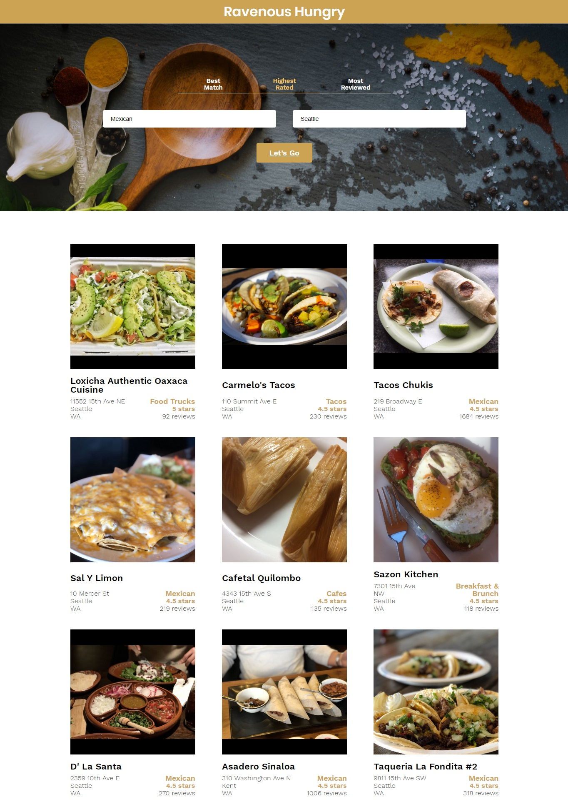

# BUILDING FRONT-END APPLICATIONS WITH REACT

**Create Project & Components**

Welcome to the first installment of the Ravenous project! Over the next couple of weeks, you’ll build a website called “Ravenous Hungry”, a Yelp-like clone.

In total, there will be four parts to this project:

- Creating Static Components
- Passing Information to Components
- Setting the State of Ravenous Components
- Interacting with the Yelp API https://www.yelp.com/seeyousoon
- Today, you will start by building the first part of Ravenous: Creating Static Components.

Here’s a quick overview of how Ravenous should function:

- As a user, I should be able to search for restaurants
- As a user, I should be able to view a list of restaurants returned by the Yelp API
- As a user, I should be able to sort through restaurants using a filter

The four projects will test your knowledge of JavaScript and React, all with the goal of building a Yelp-like clone. If you want to get a feel for what Ravenous can be, visit the Yelp website and search for restuarants in your area.

Finally, a few notes before getting started:

- In each project, you’ll be presented with the intended, final outcome (of that project) in the Codecademy browser component.
- You should expect to spend more than 1 day on this specific project. It’s the base of the entire app, and it will likely take a few days to complete this project. It’s OK if it is not all finished in one day.
- If you don’t understand how to implement a certain part of the project, we’ll provide guidance as needed. However, you should expect to search Codecademy for the exercises that will provide you with the relevant information.
- You should expect to complete all four Ravenous projects on your personal computer using your preferred tools (terminal, text editors, etc.).

## Let’s get started!

### Available Scripts

In the project directory, you can run:

### `npm start`

Runs the app in the development mode. 
Open [http://localhost:3000](http://localhost:3000) to view it in the browser.

The page will reload if you make edits. 
You will also see any lint errors in the console.

### `npm test`

Launches the test runner in the interactive watch mode. 
See the section about [running tests](https://facebook.github.io/create-react-app/docs/running-tests) for more information.

### `npm run build`

Builds the app for production to the `build` folder. 
It correctly bundles React in production mode and optimizes the build for the best performance.

The build is minified and the filenames include the hashes. 
Your app is ready to be deployed!

See the section about [deployment](https://facebook.github.io/create-react-app/docs/deployment) for more information.

### `npm run eject`

### `npm run build` [fails to minify](https://facebook.github.io/create-react-app/docs/troubleshooting#npm-run-build-fails-to-minify)

